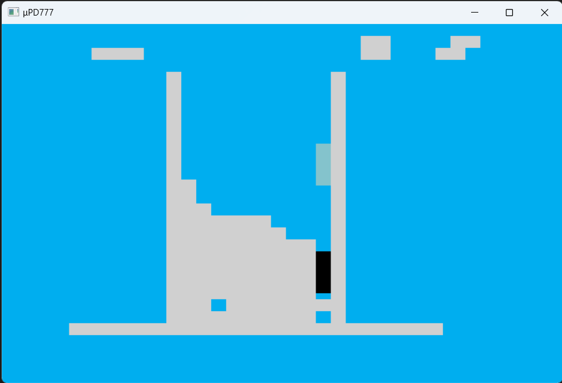

# NekkoRis

# これは何？

「ねっこりす」は、画面上部から落ちてくるブロックを動かし横一列に並べて消していくゲームです。

# 使用操作キー

| 入力 | 操作 |
|---|---|
| ゲームセレクトキー | ゲーム開始、又は、ホールド  |
| レバースイッチ | ブロックを左右に移動します  |
| PUSH1 | ブロックを左回転します  |
| PUSH2 | ブロックを右回転します  |
| PUSH3 | ブロックをハードドロップします  |
| PUSH4 | ブロックを下に移動します |

# 遊んでみる

WebAssemblyという機能を使用しブラウザで動くようにしたものです。  
　⇒ [GitHubPages: NekkoRis](https://w88dodpecuthlol.github.io/PD777supplement/index.html?code=app/NekkoRis/nekkoris.bin777&ptn=app/NekkoRis/nekkoris.ptn777)

# 動作画面

※画面は開発中のものにつき、実際のとは異なる場合があります。

# 取扱説明書

# 開発後記

namnium様作成の物からの移植です。  
 ⇒ https://github.com/anotherhollow1125/tetris_by_rust_lib

Rustから一旦C++に移植し、そこからμPD777のアセンブラに落とし込みました。  
おかしな挙動をしたらC++でトレースしながらμPD777のアセンブラを追いかけるという  
奇妙な状態のなか、なんとか動くものを作ることができました。  
（途中、諦めようかと思いましたが……）

## 実機だと動かない（多分）

スタックを4階層使用しているので、3階層までしか無い実機では恐らく動作しないと思われます。

## 描画について

* 枠と固定されたブロックは、１ライン毎にNRMレジスタに直接値を書き込むことにより  
  力技で描画をしています。  
  以前見かけた古のテクニック、MZ-700でビットマップを表示する方法を参考にしました。  
  ⇒ http://www.maroon.dti.ne.jp/youkan/mz700/y2k.html  
  力技の変則的なものなので、果たして実機で通用するのかどうかは不明です。

## テーブル参照が苦手？

* ブロック内部の１個１個の座標をテーブルで持っているのですが、  
  テーブルを参照する良い方法が恐らく？無く苦労しました。

テーブル参照は、おそらくこんな感じになってしまう……

    ; 1:I 2:O 3:S 4:Z 5:J 6:L 7:T
    GetMinoColor:
        $02=>A1                 ; 1:I LIGHT BLUE
        IF(M>=$02) $0C=>A1      ; 2:O YELLOW
        IF(M>=$03) $04=>A1      ; 3:S GREEN
        IF(M>=$04) $08=>A1      ; 4:Z RED
        IF(M>=$05) $02=>A1      ; 5:J DARK BLUE
        IF(M>=$06) $0E=>A1      ; 6:L ORANGE
        IF(M>=$07) $0A=>A1      ; 7:T PURPLE
        JP ReturnGetMinoColor

※ROMの内容を読み込む命令がないので、どうしようもないのかもしれない。

## A11の壁

ROMのアドレス空間を隔てるA11の壁があります。  
0x400を境に前半0x000～0x3FF、後半0x400～0x7FFの２つに分かれており、  
JP(ジャンプ)命令では、この２つを行き来することができません。  
まさしくジャンプでは超えられない壁となっています。  

JS(サブルーチン)命令は、前半部分を呼び出すことはできますが、  
後半部分を呼ぶことはできません……。  

これにより前半部分にサブルーチンを置き、後半部分からそれらを呼び出す  
ようなコードになります。

コード領域が少なくなってくると、重複部分をサブルーチン化するのは
常套手段なのですが、この壁があることで置けるコード量が少なくなって
しまいます。（スタックも３階層までで、深く潜れない）

## ビルド方法

    asm777 nekkoris.asm777 nekkoris.bin777
    ptn777 nekkoris7x7.png nekkoris8x7.png obj\nekkoris.ptn777

# 謝辞

* namnium様のライブラリを参考にさせていただきました、感謝。
